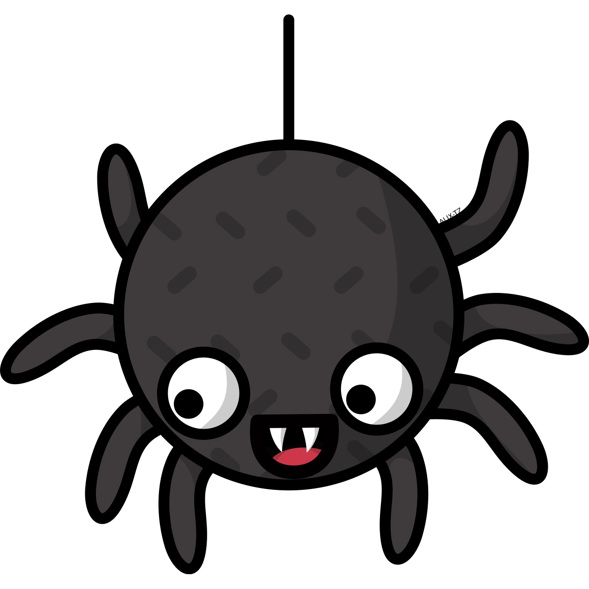

# Ungoliant

 

  
[](https://codecov.io/gh/oscar-corpus/ungoliant)

🕷️ **Ungoliant is a high-performance pipeline that provides tools to build corpus generation pipelines from CommonCrawl.** 🕷️

It currently is the generation pipeline for [OSCAR corpus](https://oscar-corpus.com), from [CommonCrawl](https://commoncrawl.org).
Ungoliant is a replacement of [goclassy](https://github.com/oscar-corpus/goclassy).


                           

## Installation

### Installing/Compiling the binary
* Via `cargo`: `cargo install ungoliant`
* Via `git`: `cargo install --git https://github.com/oscar-corpus/ungoliant`

Ungoliant needs numerous dependencies that should be compiled when installing. However `cmake / gcc` can be needed as the project uses [fasttext-rs](https://github.com/messense/fasttext-rs).

### Getting the language identification file (for fastText):

Use `curl https://dl.fbaipublicfiles.com/fasttext/supervised-models/lid.176.bin -o lid.176.bin`.

## Usage 

The usual way of generating corpora is:

1. Fetch the `wet.paths.gz` file from the last [CommonCrawl dump](https://commoncrawl.org/connect/blog/) and decompress it.
2. Download the files using the `download` command.
3. Generate the corpus using the `pipeline` command (it may take some time).
4. Deduplicate if needed using the `dedup` command.
5. Split into smaller files using the `split` command.
6. Compress using `compress` :-)
7. `package` will create language specific folders, move the relevant files in them and put a [checksum file](https://en.wikipedia.org/wiki/File_verification).

You can find more information on each command's `--help`.

```text
ungoliant 0.1.0
corpus generation tool.

USAGE:
    ungoliant <SUBCOMMAND>

FLAGS:
    -h, --help       Prints help information
    -V, --version    Prints version information

SUBCOMMANDS:
    compress    Compress
    dedup       Deduplicate a generated, not split corpus.
    download    Downloading of CommonCrawl
    help        Prints this message or the help of the given subcommand(s)
    package     package
    pipeline    Run pipeline
    split       Split a not split corpus
```

## Documentation

Ungoliant is not yet on docs.rs: use `cargo doc --bins --open` to open the documentation.

## Benchmarking

Benchmarking is not (yet) updated.
~~Use `cargo bench` to run benchmarking.~~
~~See results in `target/criterion/report/index.html`~~
